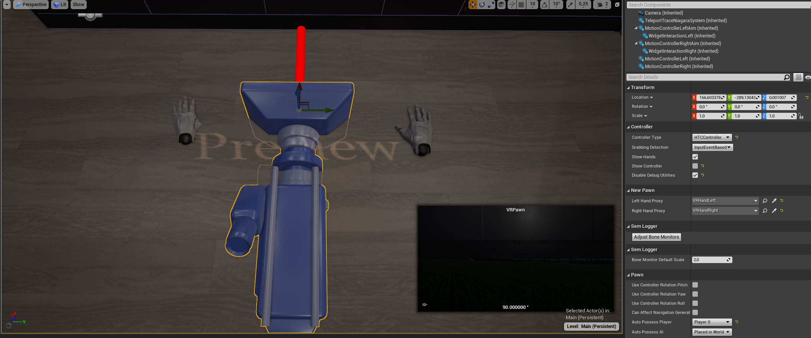

# Configurations

The new UVRHands plugin consists of two main objects
- VRPawn
- VRHandRight
- VRHandLeft

Each one can be configured individually but the configuration in the Main scene should be sufficient at start.
In the scene it should look like displayed in the following picture:

Here the pawn is focused.
# Pawn
The following headers belong to the segmentation of the details window of the Unreal Engine.
## Controller

*NOTE: The Hands are intendet to be used with Valve Index Controller or Manus Hands. The HTC Controller are also possible, but since the lack of input axes, they are not animated as well as the other controllers.*

The different checkboxes do the following:

- **Controller Type** defines which controller should be displayed and used. 
The options are 
    - Manus
    - SteamIndexController
    - HTC Controller

and the option changes the appearance and the inputs listened to. It is adviced to change the option to match the current controller.

There may be the case that the input mapping is not set up correctly in newly cloned repositories. 
In this case you have to manually set the inputs.

- The **Grabbing Detection** option changes the grab detection mechanism. Possible values are
    
    - Input Event-based     
    When enabled grabbing and releasing items is done solely event-based wich means that an item is grabbed when an grab event defined in the project inputs is thrown.
    
    - Finger Proximity  
    Enabling this function only works when animated hands (currently Manus Hands and SteamIndexController) (!Does not work with HTC controller atm) are used. 
    It calculates every frame the distances between the fingers and the thumb and when the distance (which can be Configured inside the VRHand->CollisionObserver Component) falls below the threshold, a grab is triggered.
    At the moment this works best with the SteamIndexControllers.
    It is intended to work with the manus hands but at the moment the precision is not satisfactory enough. In the future it should be used for more natural grabbing experiences. 
    
    - Disabled  
    Disables grabbing in general

    - SLGraspEventBased     
    Used when utilizing the SemLogger this option synchronizes the timings of grab and ungrab with the SLManipulatorMonitor events. It utilizes the Bone Monitos which have to be set up correctyl before.

- The option **Show Hands** allows to display virtual hands. 
It is recommended to turn on this feature while using the Manus hands but can also be ticked when using controllers.
This function can be combined with the show controller tickbox as wished. 
All combinations are possible but at least one should be enabled. 

- The option **Show Controller** enables and disables the controller visuals. It can be combined with the *Show Hands*. While the controller is shown, the Hand is attached to it and rotated about 90 degree for better interaction. 

When only *Show Hands* is enabled, the Hands are positioned such they have the same position and orientation as the real hands, independently whether an actual controller is used or not.

- **Disable Debug Utilities** refers to the spheres and detectors of the Hand and enable or disable the visuals

## New Pawn
This subsection of the Pawn holds the references to the hands as depicted in the image on top of this page.

[Back To Main Page](../README.md)