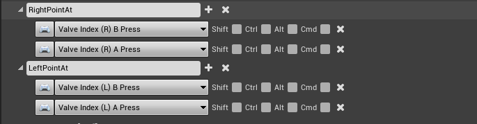

## Pointing

With the new hands user can point with their hands.
To point, the inputs 

 

 are used. At the moment only the Right hand is used for pointing. The left input is currently not used.

 For Manus Hands (motion capture hands), pointing is invoked by stretching your index finger while bending all other fingers; like it is done in reality.

 When invoked, a laser is drawn from your hand in forward direction. At the end a UI is spawned which contains of a sphere at the hitpoint of the laser with the environment and a display of wheter to approve or reject the target hit. Both hands can approve or reject a pointed target.

 To use the object pointed at, add your code/functions to BP: VRHand/EventGraph

 

 [Back To Main Page](../README.md)