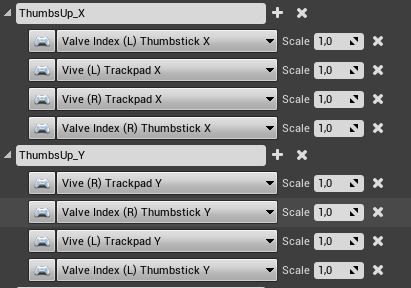

## Rating

Like Pointing (TODO Reference to pointing) rating can be used as an Interaction. 

It is intended to mimic the normal rating of behaviour like thumbs up for good, thumbs down for bad, and thumbs horizontally for average behaviour. 
It may also be used for other purposes.

To Invoke the interaction, the following inputs are used.
 

 Based on the combination of X and Y values of the Input, the resulting vector is derived.
 Then the resulting rating is scaled onto a scala from 1 to 10 where 10 is the best, an 1 the worst result.

 For example, using the HTC controller and the right hand,
 pressing the touchpad on the top, would invoke a rating of 10. Pressing it at the bottom would result in a rating of 1, and pressing it at the right or left would result in a rating of 5. 

 The other ratings are also possible. The touchpad hereby lineraly interpolates the position from bottom to top and gives the respective result.

 The index controller works the same way, but here the joistick ist used instead. 

 For motion capture gloves like the Manus hands it suffices to do a fist while stretching the thumb like a real thumbs up gesture. Hereby the orientation of the hands is used to interpolate the final result of the rating.

 [Back To Main Page](../README.md)